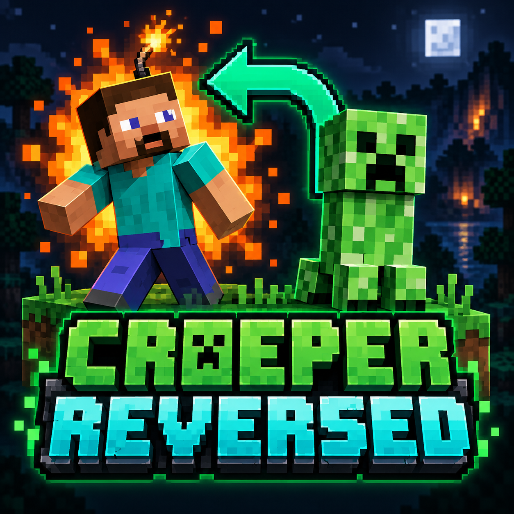

<p align="center">
  
</p>

<h1 align="center">Creeper Reversed</h1>
<p align="center"><strong>The creeper stays calm. You hiss. You explode.</strong></p>
<p align="center">
  <a href="https://github.com/Magersers/Creeper-Reversed/releases"></a>
  
  
  <a href="LICENSE"></a>
</p>

---

A tiny Minecraft Java mod with one very unfortunate role reversal. Walk too close to a creeper, and **you become the bomb**. Works with Steve, Alex, and custom player skins.

## How it works

1. **Get close.** A living creeper within 3 blocks and clear line of sight starts your fuse.
2. **Hear the warning.** The familiar creeper hiss plays at your position, with smoke particles visible to nearby players.
3. **Run — or explode.** After 30 game ticks (1.5 seconds at 20 TPS), you explode with the normal creeper power of 3 and die.

Once started, the fuse keeps burning while the triggering creeper is within 7 blocks and visible. Break line of sight or get at least 7 blocks away to gradually defuse, just like the vanilla creeper swell logic. A charged creeper doubles explosion power to 6.

Creepers cannot detonate, including when ignited with flint and steel. They keep their usual movement and targeting. Creative and Spectator players do not trigger the effect. Each player's fuse is independent in multiplayer.

The explosion uses vanilla explosion mechanics, including damage, knockback, sound, and particles. Block destruction follows `mobGriefing`. The player dies at detonation, including with armor; normal death, inventory, and `keepInventory` rules apply. This does not add a player swelling/flashing animation or copy potion effects into a lingering cloud.

## Download

Get the matching JAR from **[GitHub Releases](https://github.com/Magersers/Creeper-Reversed/releases)**. Choose exactly one file for your Minecraft version and loader.

| Minecraft | Loader | Java | Release file |
|---|---|---|---|
| 1.20.1 | Fabric 0.16.14+ | 17 | `creeper-reversed-fabric-1.20.1-1.0.0.jar` |
| 1.20.1 | Forge 47.4.0+ | 17 | `creeper-reversed-forge-1.20.1-1.0.0.jar` |
| 1.21.1 | Fabric 0.16.14+ | 21 | `creeper-reversed-fabric-1.21.1-1.0.0.jar` |
| 1.21.1 | NeoForge 21.1.252+ | 21 | `creeper-reversed-neoforge-1.21.1-1.0.0.jar` |

## Install

1. Install the matching Minecraft loader.
2. Put the matching JAR in your instance's `mods` folder.
3. Launch Minecraft and approach a creeper in Survival.

**Fabric API is not required.** No configuration or extra content packs are needed. Install on both the server and clients for multiplayer. Other Minecraft versions and cross-loader combinations are not supported by these files.

## Build from source

Install JDK 17 for Minecraft 1.20.1 and JDK 21 for Minecraft 1.21.1. Use the committed Gradle wrapper (8.8).

```sh
./gradlew build -Ptarget=fabric-1.20.1
./gradlew build -Ptarget=forge-1.20.1
./gradlew build -Ptarget=fabric-1.21.1
./gradlew build -Ptarget=neoforge-1.21.1
```

On Windows, use `gradlew.bat`. Build outputs are in `platforms/<target>/build/libs/`. Each invocation loads only the selected platform to isolate loader toolchains. Shared gameplay code lives in `common/`. CI builds and tests all four targets.

## Testing and compatibility

The build includes executable fuse tests for exact timing, gradual defusing, clamping, and reset behavior. See [TESTING.md](TESTING.md) for validation details and the gameplay checklist. Mods that replace creeper AI, explosions, player death, or the same mixin targets may conflict. Report problems with your Minecraft version, loader version, and game log in [Issues](https://github.com/Magersers/Creeper-Reversed/issues).

## Credits

Created by **Magersers**. Code is MIT licensed. Logo generated with OpenAI's built-in image generation tool; the prompt is recorded in [assets/ARTWORK.md](assets/ARTWORK.md). Minecraft is a trademark of Mojang/Microsoft. This is an independent fan project.
